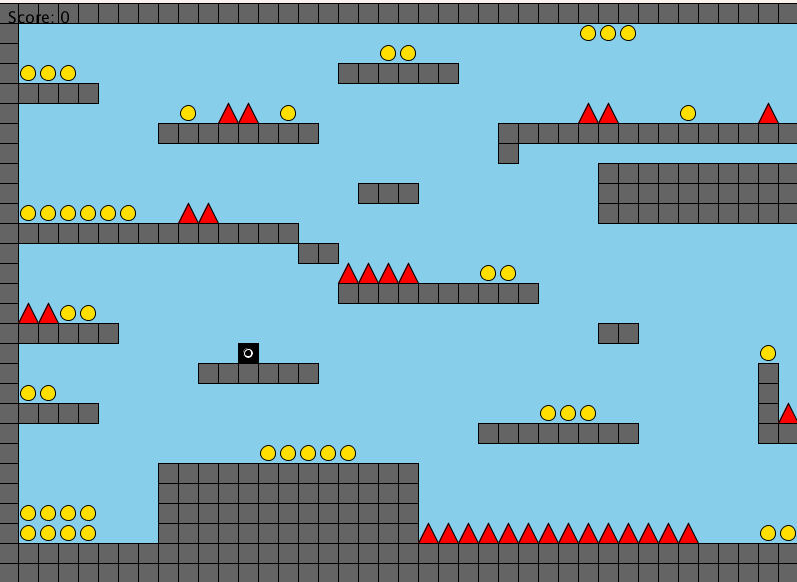

# Money Collector Game
## Overview
**Money Collector Game** is a simple 2D platformer game where players collect coins while avoiding spikes. The game features multiple levels, rotating coins, moving spikes, and a vertical scrolling mechanic.
This project was inspired by [Skydron](https://openprocessing.org/sketch/2219220), an incredible game that influenced many of the mechanics and ideas used in this project.



---

## Features
- **Platforming mechanics**: Jump, move left and right, and navigate through challenging levels.
- **Dynamic spikes**: Moving spikes add an extra layer of difficulty.
- **Rotating coins**: Collect coins to increase your score.
- **Level transitions**: Complete levels to unlock new challenges.
- **Sound effects and music**: background music and sound effects for actions.

---

## How to Play
1. Use the arrow keys to control the player:
   - **UP**: Jump.
   - **LEFT**: Move left.
   - **RIGHT**: Move right.
2. Avoid spikes and collect coins to increase your score.
3. Complete all coins in a level to unlock the next one.

---

## Game Screens
### Main Menu
The main menu provides options to:
- Start the game.
- View instructions.
- Learn about the developers.

### Gameplay
### The player navigates through platforms, collects coins, and avoids spikes.
---

## Instructions for Developers
### Prerequisites
- Download and install [Processing 3](https://processing.org/).
- The game assets (sounds) are in the Processing Sketch folder.

### How to Run
1. Clone this repository:
   ```bash
   git clone https://github.com/ABOSALAH2020/Money-Collector-Game
